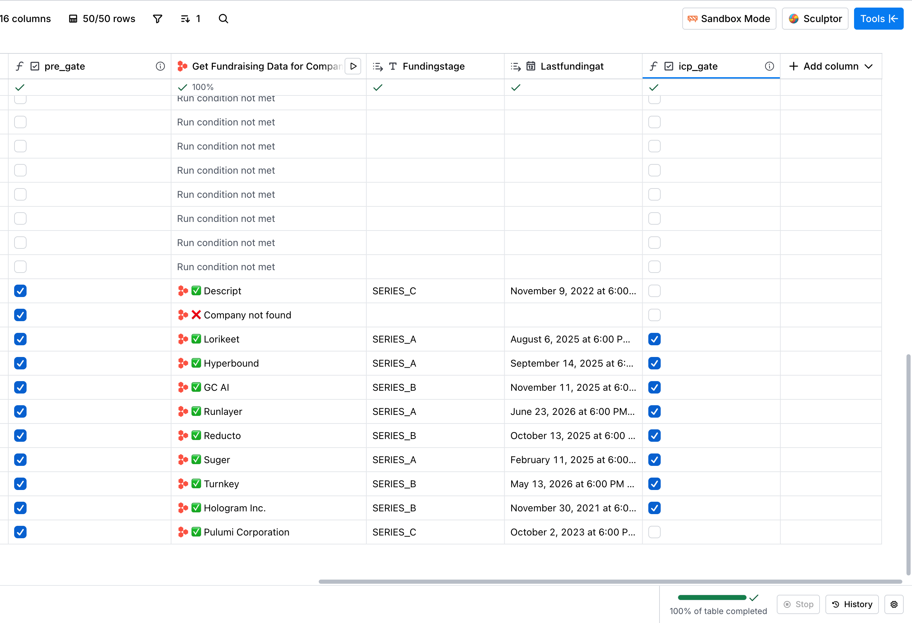
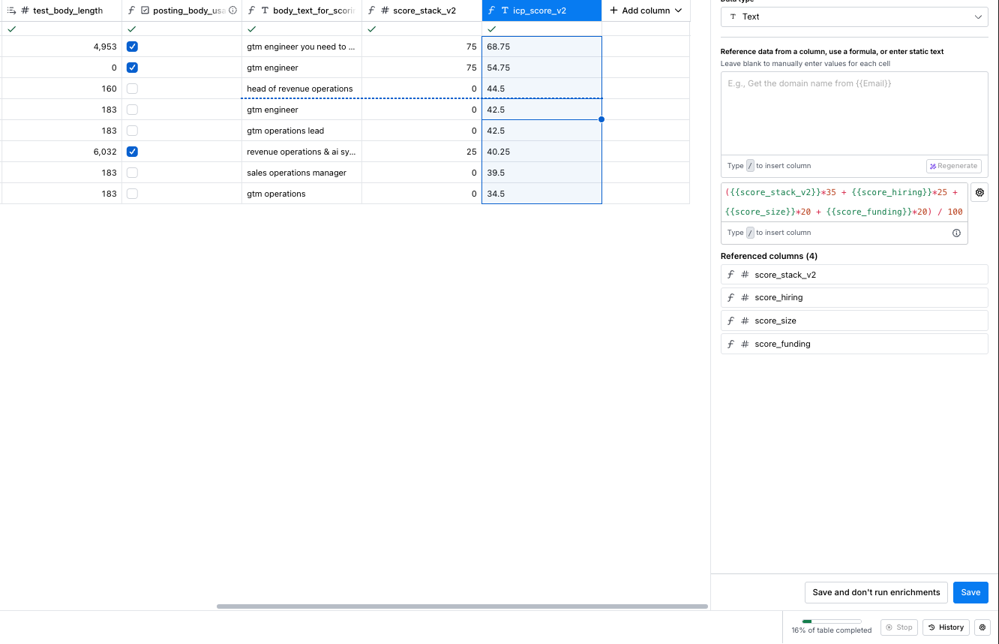
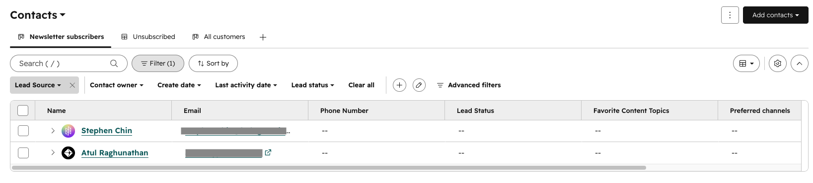

# 50 accounts in, 2 in HubSpot: a cost-ordered enrichment system — benchmarked against my own pipeline

**At a glance**

| | |
|---|---|
| **Funnel** | 50 companies in → 8 passed the ICP gate → 2 CRM-ready contacts in HubSpot |
| **Cost** | 90.7 Clay credits total (4.5% of the trial) · 11.3 cr/account fully loaded · 3.2 cr/account on the slice where n8n does the same job, against n8n's confirmed $0.00 |
| **Timeline** | Table built 2026-07-15→17; enrichment, contact lookup, CRM push and benchmark run as single sessions through 07-30 |
| **Stack** | Clay (waterfall, Claygent, formulas), Harmonic, Surfe, Icypeas, HubSpot, n8n + Supabase (the incumbent system) |
| **Artifacts** | 26 build screenshots, full credit ledger, 27 numbered deviations, benchmark table — all in this repo |

---

## Business Problem

Manual account research is slow and the paid databases that replace it are expensive — ZoomInfo-class tools run $15k+/year with match rates that don't always justify it. The actual job is turning a raw company list into scored, pipeline-ready leads without burning budget on accounts that were never going to qualify.

This project builds that system on Clay and benchmarks it against the n8n-based Lead Intelligence Pipeline I already run in production. The target list is B2B SaaS companies currently hiring RevOps and GTM roles — Series A or B, 20–200 employees, US-based. The output is a ranked, enriched lead list with contacts pushed to HubSpot.

The meta-angle: the companies on this list are hiring for roles I'm applying to. The enrichment output doubles as my own outbound target list.

---

## The System

Six stages, each one gating the next.

**Seed data** (company, domain, posting URL, title) → **firmographic waterfall** (Clay Enrich Company at 0.5 cr/row, then Harmonic at 4 cr/row, conditional) → **ICP gate** (four boolean checks, cost-ordered) → **posting-body scrape** (0.1 cr/row) → **scoring** (four formula columns, zero credits) → **contact waterfall + HubSpot push**.

The gate is four conjunctive checks in cost order: title regex (free, seed data), employee count 20–200 (free tier), US-based (free tier), Series A or B (cheap provider, runs last). Missing free data is a fail.

Scoring is four dimensions, weights summing to 100:

| Dimension | Weight | Why |
|---|---|---|
| Stack match | 35 | Highest weight because it's the only dimension that reads intent. A company writing "HubSpot, Clay, Zapier" into a job posting is telling you what they run and what they're trying to fix |
| Hiring intensity | 25 | Seniority of the role plus how many GTM seats are open — a proxy for how urgent the problem is |
| Size sweet spot | 20 | 100 points at 40–120 employees, 60 at the edges. Big enough to have the problem, small enough that one person's opinion still moves a purchase |
| Funding recency | 20 | Budget signal, but the weakest one — a raise 11 months ago and one 13 months ago aren't meaningfully different buyers |

Aggregation is `Σ(dimension × weight) / 100` in a formula column. Same scoring contract as the n8n pipeline's ICP config — two runtimes, one schema.

There's exactly one AI column in the build: `gtm_motion`, which classifies each company as PLG / sales-led / hybrid / unknown from homepage and pricing text. It does **not** feed scoring. It's context for whoever reads the row, and it's deliberately fenced off from anything that has to be reproducible.

---

## Design Decisions

If this build had a recurring theme, it was this: every significant problem got caught before it cost anything.

Three examples. Clay's AI formula assistant generated a keyword-matching formula that was syntactically valid and semantically backwards — it tested the column value as a regex pattern against the literal string "hubspot" instead of the other way around. Every row scored zero, no error thrown. Caught by reviewing the output before treating it as ground truth. Fixed in five minutes. The batch-corruption risk in n8n's website scraper was the same category: the aggregation node assumes exactly one lead in flight, so feeding all 8 companies through in a single execution would have silently merged their scraped pages under whichever lead happened to be first. Caught by reading the code before running it. And the dead-posting detection logic went through two failed approaches before landing on a length-based check — substring signals kept colliding with Ashby's own HTML shell text, live or dead. Caught by testing against a known-good sample before writing the detection rule.

The other decisions that shaped the output more than anything else:

**Cost-ordered gate.** Cheap signals run first; expensive ones only fire if the row survives. Missing data on a free check equals fail — no rescue lookups. Nine rows died that way. That's not a data quality problem, it's the policy working. The alternative is spending credits to confirm that a company with no domain in your seed list still doesn't fit your ICP.

The ordering pays for itself immediately. Harmonic — the funding-stage provider, 4 cr/row — ran on 10 rows instead of 50 because it sat behind the three free checks. Running it across the whole list would have been 200 credits. It cost 40. That 160-credit gap is larger than everything else in the build combined, and it came from column order, not from a cheaper vendor.

One thing the plan got wrong: the design specified "free → cheap → expensive," and there was no free tier. Clay's catalog had nothing that ran without either credits or an external account. Lusha looked free until it demanded its own authentication — pulled before any row ran, $0 spent. The waterfall floor became Clay-native Enrich Company at 0.5 cr/row. The principle survived; the specific tier didn't exist.

**No LLM in the scoring path.** Four formula columns, deterministic aggregation. When Hyperbound's score_stack came out wrong because "outreach" was matching a common noun instead of the tool, the fix was a 30-second eyeball of one row's body text and a punctuation-boundary adjustment. Deterministic scoring makes anomalies cheap to find and cheap to fix. LLM-based scoring would have smoothed over the same problem invisibly and cost credits every time it did.

This is why the one AI column classifies rather than scores. Classification is a judgment a human can check by reading one cell. Scoring is arithmetic that has to be identical on every rerun.

**One amendment to the gate, then locked.** The title regex initially missed "GTM Strategy & Operations" — a real variant, in-ICP, mis-parsed by word adjacency. Widened the pattern once, after auditing the seed list, then froze it. A gate you keep loosening whenever a row you like fails isn't a gate. One documented amendment against observed data is change control; three is motivated reasoning.

---

## Economics

Clay runs on credits, not dollars — there's no clean conversion rate from trial credits to what you'd actually pay on a plan, so I'm reporting everything in native units. Inventing a dollar figure felt dishonest.

Three ways to read what this cost:

| Scope | Clay | n8n |
|---|---|---|
| Like-for-like (homepage + pricing scrape and AI classification — the closest analog to what n8n's benchmarked sub-workflows do) | 3.2 cr / account | $0.00 (confirmed — no API calls in this slice) |
| Full-funnel (waterfall + gate + classification + body scrape + contact lookup + CRM push, all 8 accounts) | 11.3 cr / account | No number exists — scoring and CRM delivery aren't built yet |
| Per contact that actually reached HubSpot | 45.4 cr / lead | — |

A note on that first row, because it's the number most likely to be quoted out of context: the like-for-like slice is Day 1's site scrape plus Claygent classification (25.6 cr across 8 accounts), not the full Clay run. It's the only slice where both systems are doing the same job. Comparing anything wider is comparing a complete pipeline to three sub-workflows.

The 45.4 number looks bad until you remember what the other 88 credits were doing: disqualifying 42 companies that had no business in the pipeline. That's the product. A system that doesn't disqualify either skips it entirely or pushes the work downstream to a human — both options cost more.

That's also the honest answer to the ZoomInfo comparison in the opening. I can't give you a dollar-for-dollar number, but I can give you the shape of the difference: this system's cost scales with **accounts evaluated**. A seat-based database scales with **people seated**, whether they research 50 accounts this quarter or 500. Those are different curves, and which one you want depends on whether your constraint is headcount or list size.

The contact waterfall makes the same point at smaller scale. Surfe hit on Hyperbound at 0.1 cr; only Hologram escalated to Clay's 0.5 cr provider — 0.7 cr across both, 0.35 average per contact found. Running the expensive provider on both rows upfront would've been 1.0 cr for the same result. Add Icypeas for email lookup (0.2 cr/row, both hit at the highest confidence tier on the first try) and the fully-loaded contact cost is 1.1 cr for two leads, 0.55 each.

The caveat that belongs next to that arithmetic: n=2. The 40% saving is real arithmetic on the rows I ran, not a provider hit rate. Two contacts can demonstrate that a waterfall pattern works. They cannot tell you how often Surfe misses.

---

## Results

Quick context: Clay's free tier caps tables at 50 rows, so I built a deliberate subset from the full 110-row list — same title-category proportions, same blank-domain ratio, both edge-case title variants preserved. All the numbers below are from that 50-row build.

Funnel: 50 rows in, 8 passed the ICP gate, 2 ended up in HubSpot. Of the 42 that didn't make it — 9 failed because data was missing (blank domains, no country returned, one Harmonic miss) and 33 failed on actual criteria. The missing-data failures cost nothing in rescue lookups. That was the point.

The classification column split the 8 survivors into 4 hybrid, 1 PLG, 1 sales-led, and 2 unknown. The two unknowns are the interesting ones: both came back unknown because the scraper handed the classifier no usable product text — one JS-blocked, one wrong-page. The prompt's do-not-guess rule held. An AI column that says "unknown" when it has nothing to read is working correctly; one that produces a confident classification from an empty page is the failure mode nobody catches until it's in a report.

**The most interesting thing that happened was Hologram.** Day 1's title-only scoring put it dead last — icp_score 28.5, rank 8 of 8. After scraping the actual job posting, it jumped to second at 54.75. The posting had HubSpot, Clay, n8n, and Zapier all in the requirements section. The worst-ranked lead on day one was one of the two best fits once I actually read what they were asking for.

With one asterisk that stays visible: Hologram's posting body exceeded Clay's 8kb formula-access cap, so the formula engine couldn't read the cell even though the detail view showed it fine. I verified all four tools by hand against the posting and hardcoded that dimension at 75 with a single-row override. The score is correct and the ranking is real, but it's a manual value, not a computed one — and the platform limitation behind it isn't fixable with a smarter formula. The production fix is upstream: scrape config that returns markdown-summarized bodies under the cap.

The scrape also turned up something I didn't expect: 5 of the 8 gate-passer postings had already closed by the time I went to enrich them — about a week after seed collection. 62.5% churn in a week. Because the scrape ran after the gate, those five rows only cost 0.1 cr each before getting flagged and downgraded. If enrichment had run upfront on all 50 rows, the same churn rate would've meant paying for a lot of dead data. Waterfall ordering isn't only about per-row price. It's about not paying for stale data.

**Two contacts made it to HubSpot:** Atul Raghunathan at Hyperbound (68.75) and Stephen Chin at Hologram (54.75), both emails verified at the highest confidence tier.

Hyperbound's match is worth a sentence, because it's not what the config asked for. The title filter targeted Head of RevOps / VP Sales; Surfe returned a Co-Founder & CTO/CRO. That's the right answer — Hyperbound is 30 people and hasn't hired a revenue ops leader because a founder is still doing the job. The seniority filter caught it without special-casing, which is what you want the pipeline to do at that stage.

**Then what?** The push isn't a create-and-hope. Every contact goes through an explicit lookup first: if HubSpot returns a matching contact ID, the row routes to Update; if it returns nothing, it routes to Create. I tested it deliberately — pushed Atul, confirmed the record, then force-re-ran the same row and confirmed it updated in place rather than creating a second Atul. That mirrors the dedupe contract the n8n pipeline enforces (30-day domain-keyed update-not-insert), so both systems land leads in the same shape.

It worked 1 of 2 clean. Hologram's push hit a Clay reference-resolution problem — the nested path into the lookup's response object wouldn't evaluate after a "no results" return, and Clay populates that cell with a display string (`❌ No objects found`), not a null, so the conditional gates read it as content. Rather than debug Clay's chained-action references against a trial clock, I pushed Stephen through a simplified gate and let HubSpot's server-side email dedupe hold the safety net. No duplicate was created. But that row didn't get the explicit lookup-first verification Hyperbound got, and pretending otherwise would undercut the whole point of running the test.

Both records also got the first-ever values written to HubSpot's `icp_score` field — the pipeline created that property months ago targeting a scoring service that isn't built yet. Clay closed the loop from "column exists as a target" to "column contains data," against a schema the other runtime defined.

---

## Build vs. Buy

Full comparison table is in the repo ([`outputs/step4_comparison_table.md`](outputs/step4_comparison_table.md)). Here's the short version.

n8n ran the same 8 accounts through its website scraper, tech-stack fingerprint, and news sub-workflows at a confirmed $0.00 — no API calls in that slice, just HTTP fetches on my own VPS. On the narrow scope where both systems overlap, n8n wins on cost by a lot and it's not close.

But that narrow scope is the honest caveat on both sides. Clay ran end-to-end: gate, score, contact lookup, CRM push. n8n's equivalent of that full pipeline doesn't exist yet — scoring ships in a future issue, CRM delivery after that. So the $0.00 figure and Clay's 11.3 cr/account aren't really the same thing. They're measuring different slices of the same job.

**Time is the axis the cost table hides — and it isn't machine time.** The n8n side of this benchmark took 61 seconds of actual compute. All of it. Twenty-four sub-workflow runs across 8 accounts, averaging 7.6 seconds per account, with the slowest at 12.6 and the fastest at 5.2. The $0.00 cost figure isn't the whole story of how cheap that side is; the workflows are genuinely fast.

The expense was entirely human. Each of those 24 runs had to be triggered by hand, one at a time. Which brings up the thing the benchmark surfaced that wasn't obvious from the docs: n8n's sub-workflows have no webhook trigger. They're only ever called by an orchestrator that isn't wired yet, so every run meant pinning a lead UUID onto a trigger node in the editor and clicking Execute — plus inserting 8 placeholder rows in Supabase first, because the workflows take a lead ID, not a domain. That's not a knock on n8n. It's what "orchestration not built" actually costs in practice, which is different from what it sounds like on paper. The Clay table, for contrast, went from empty to gated, scored, and screenshotted in two calendar days without leaving the browser. Sixty-one seconds of compute lost to a system that couldn't be triggered is the whole build-vs-buy argument in miniature: at this volume you aren't buying execution speed, you're buying the absence of the operator.

The news sub-workflow also put real numbers behind a limitation the pipeline docs already named. Of the 8 companies, 3 came back with 5 articles each that had nothing to do with them — Turnkey matched generic "turnkey solution" business copy, GC AI matched Government of Canada press releases, Hologram matched a NASDAQ-listed hologram optics company. The sub-workflow reported all three as clean successes. The severity tracks company-name distinctiveness, not company size — which means it's invisible in testing until you happen to pick a badly-named company.

One signal comparison worth flagging: n8n's tech-stack fingerprint found Next.js on Hologram's public site and nothing else, and detected zero tools on Suger.io despite a clean fetch — JS-injected scripts are invisible to a static HTML parse. Clay's score_stack_v2 gave Hologram 75, based on HubSpot, Clay, n8n, and Zapier appearing in the job posting. Neither is wrong. They're reading different surfaces: marketing site scripts vs. hiring copy. In practice you want both.

Clay had its own friction, and it wasn't where I expected. 22 Clay-side deviations logged across the build — a formula engine that returns false when you compare a function's output to a number inline (fix: decompose into two columns, same as breaking a query into CTEs), action outputs that arrive as object trees where you expect strings, cached lookup results that need an auto-run toggle to bust, and a cost display that showed 10.5 cr/row in the config panel for an action that billed 0.5. Twenty-one times off. It cost nothing here because the action was cheap, but working from that estimate on a tight budget would have blocked a run that was actually affordable.

**When to use which:** Clay is the right call when you're moving fast and need the full pipeline — gate, score, contact, CRM — in a few days without building infrastructure. n8n wins on marginal cost and control once you have volume and the orchestration layer is wired. Right now, for this kind of sprint, Clay. At scale with orchestration shipped, n8n.

---

## What this system doesn't do

Four limitations I'd want a buyer to know before they trusted the output.

**It reads term presence, not intent.** Suger's posting explicitly de-emphasizes Zapier — "we still use tools like zapier when useful, but they are not the core system." The keyword match scored it +25 anyway. I chose not to patch this: it's the same class of problem as the Outreach false positive but much harder to catch syntactically, and the fix is exactly the LLM-in-the-scoring-loop I designed out. Named as a real cost of determinism rather than hidden.

**The score lives on the wrong object.** `icp_score` is a company-level signal — firmographics and posting text, nothing about the person — and I pushed it to the Contact record. That's for consistency with the n8n pipeline's contact-level convention. A production version puts the score on the Company object and lets Contacts inherit it through association.

**Two contacts is a pattern, not a sample.** Every waterfall economics claim in this write-up is arithmetic on the rows I ran. It demonstrates the mechanic works. It doesn't establish provider hit rates.

**The list goes stale in about a week.** 62.5% of the gate-passers' postings closed in seven days. Any version of this that runs monthly is enriching a list that's mostly expired.

---

## What I'd do differently

- **Relevance filter on news.** Require the company's domain or a distinguishing keyword to co-occur in the article. Three of eight companies got 100% noise reported as clean success — the status vocabulary has no way to say "this succeeded and is worthless."
- **Markdown-summarized scrape bodies under 8kb.** Removes the Hologram override entirely and makes the stack dimension computable on every row instead of most of them.
- **Score at the Company object, inherit at the Contact.** Fixes the data-model tradeoff above.
- **Webhook triggers on the n8n sub-workflows.** Not because the benchmark needed them, but because a workflow with no direct entry point can't be tested in isolation by anything except its own orchestrator — which is a much bigger problem than a slow benchmark.
- **Re-seed before enrichment, always.** Given a week of posting churn, the seed list should be refreshed the same day the paid enrichment runs, not a week before it.

---

## Repo contents

- `day1_debrief.md`, `day2_debrief.md` — full build record, 27 numbered deviations with root cause and fix, complete credit ledger reconciled against Clay's usage panel at every step
- `outputs/step4_comparison_table.md` — five-dimension Clay vs. n8n benchmark
- `outputs/step4_benchmark_capture.csv` — all 24 n8n sub-workflow runs with status, counts, and timing
- `screenshots/` — 26 build screenshots, from starting credit balance to both contacts live in HubSpot
- `REALITY.md` — ground-truth state of the incumbent pipeline, written before the sprint so no write-up claim could outrun what's actually shipped
